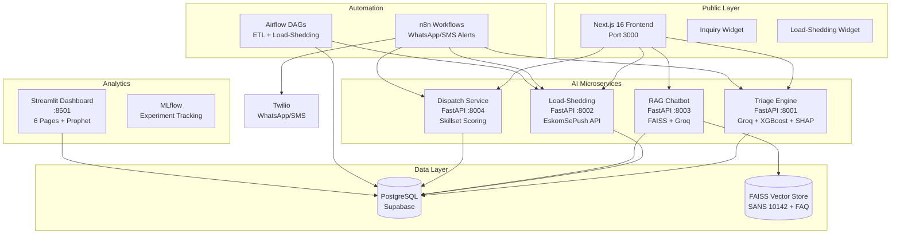

# ⚡ Rams @Elec Intelligence Platform

[](https://github.com/machetheDM/rams-elec-intelligence-platform/actions/workflows/ci.yml)

> 🚧 **In Active Development** — This project is being built as a portfolio demonstration of full-stack AI engineering skills. See [Module Progress](#module-progress) below.

**AI-powered upgrade for [ramsatelec.com](https://ramsatelec.com)** — a South African electrical and refrigeration services company operating across Gauteng and Limpopo.

Replaces a static brochure site with a functional, AI-driven business platform delivering measurable value: faster lead conversion, automated client communication, and data-driven operations.

---

## System Architecture



---

## Module Progress

| # | Module | Description | Status |
|---|--------|-------------|--------|
| 1 | Database Schema & Data Models | Star-schema PostgreSQL with Prisma ORM | 🔄 In Progress |
| 2 | ETL Pipeline | Bronze→Silver→Gold medallion architecture | ⏳ Pending |
| 3 | AI Inquiry & Triage Engine | NLP classification + XGBoost cost estimation | ⏳ Pending |
| 4 | Load-Shedding Intelligence | EskomSePush integration + WhatsApp alerts | ⏳ Pending |
| 5 | Customer Portal + RAG Chatbot | NextAuth.js + FAISS knowledge base | ⏳ Pending |
| 6 | Analytics Dashboard | 6-page Streamlit dashboard | ⏳ Pending |
| 7 | Dispatch & Job Assignment | Skillset-based technician matching | ⏳ Pending |
| 8 | Public Frontend Upgrade | Next.js 16 responsive dark-mode site | ⏳ Pending |
| 9 | Integration Testing & Deployment | Docker Compose + CI + Vercel/Railway | ⏳ Pending |

## Module Overview

| # | Module | Description | Key Tech |
|---|---|---|---|
| 1 | **Database Schema** | Star-schema PostgreSQL with Prisma ORM. 16 tables, 60+ seed jobs, 22 customers, 5 technicians. | Prisma, PostgreSQL |
| 2 | **ETL Pipeline** | Bronze→Silver→Gold medallion architecture. Excel/CSV/PDF extraction, validation, feature engineering. 200 synthetic records for testing. | Pandas, Airflow, SQLAlchemy |
| 3 | **AI Triage Engine** | NLP inquiry classification via Groq LLM. XGBoost cost estimation with SHAP explainability. Skillset-based technician matching. | Groq, XGBoost, SHAP, MLflow |
| 4 | **Load-Shedding Intel** | Real-time EskomSePush integration. 30-min Airflow DAG. Personalised WhatsApp alerts prioritising cold room customers. | EskomSePush, Airflow, Twilio |
| 5 | **Customer Portal** | NextAuth.js auth. Equipment registry, service history, compliance doc prep, RAG chatbot trained on SANS 10142. | NextAuth, FAISS, LangChain |
| 6 | **Analytics Dashboard** | 6-page Streamlit dashboard: business overview, inquiry analytics, revenue forecasting (Prophet), equipment health, technician performance, load-shedding impact. | Streamlit, Plotly, Prophet |
| 7 | **Smart Dispatch** | Skillset + availability + area familiarity scoring. Kanban job board. Technician mobile view. | FastAPI, Next.js |
| 8 | **Frontend Upgrade** | Conversational multi-step inquiry form. Real-time load-shedding widget. Service catalog with pricing. Responsive, dark mode. | Next.js 16, Tailwind |
| 9 | **Integration & Deploy** | Docker Compose local dev. GitHub Actions CI. Integration test (full customer journey). Vercel + Railway deployment config. | Docker, GitHub Actions |

---

## Quick Start

### Prerequisites
- Node.js >= 20
- Python >= 3.12
- Docker Desktop
- PostgreSQL (or use Docker)

### 1. Clone & Install
```bash
git clone https://github.com/machetheDM/ramsatelec-intelligence.git
cd ramsatelec-intelligence

# Install Node dependencies
npm install

# Install Python dependencies
pip install -r etl/requirements.txt
pip install -r services/triage/requirements.txt
pip install -r services/chatbot/requirements.txt
pip install -r services/loadshedding/requirements.txt
pip install -r services/dispatch/requirements.txt
pip install -r dashboard/requirements.txt
```

### 2. Environment Setup
```bash
cp .env.example .env
# Edit .env with your API keys (see Environment Variables section below)
```

### 3. Database Setup
```bash
cd packages/db
cp .env.example .env
npx prisma generate
npx prisma migrate deploy
npx prisma db seed
cd ../..
```

### 4. Embed Knowledge Base (for RAG Chatbot)
```bash
cd services/chatbot
python embed_knowledge_base.py
cd ../..
```

### 5. Train XGBoost Model (for Quote Estimator)
```bash
cd services/triage
python train_model.py
cd ../..
```

### 6. Start All Services with Docker
```bash
docker-compose up -d
```

### 7. Or Start Individually
```bash
# FastAPI services
cd services/triage && uvicorn main:app --reload --port 8001 &
cd services/loadshedding && uvicorn main:app --reload --port 8002 &
cd services/chatbot && uvicorn main:app --reload --port 8003 &
cd services/dispatch && uvicorn main:app --reload --port 8004 &

# Streamlit dashboard
cd dashboard && streamlit run main.py &

# Next.js frontend
cd frontend && npm run dev &
```

### 8. Access
| Service | URL |
|---|---|
| Frontend | http://localhost:3000 |
| Triage API Docs | http://localhost:8001/docs |
| Load-Shedding API Docs | http://localhost:8002/docs |
| Chatbot API Docs | http://localhost:8003/docs |
| Dispatch API Docs | http://localhost:8004/docs |
| Analytics Dashboard | http://localhost:8501 |

---

## Environment Variables

| Variable | Required | Description |
|---|---|---|
| `DATABASE_URL` | ✅ | PostgreSQL connection string |
| `GROQ_API_KEY` | ✅ | Groq API key (free tier: console.groq.com) |
| `ESKOM_SE_PUSH_API_KEY` | ✅ | EskomSePush API key (eskomsepush.gumroad.com) |
| `TWILIO_ACCOUNT_SID` | ✅ | Twilio account SID for WhatsApp/SMS |
| `TWILIO_AUTH_TOKEN` | ✅ | Twilio auth token |
| `TWILIO_WHATSAPP_FROM` | ✅ | Twilio WhatsApp sender number |
| `AUTH_SECRET` | ✅ | NextAuth.js secret (generate: `openssl rand -base64 32`) |
| `ADMIN_TOKEN` | ✅ | Dashboard access token |
| `MLFLOW_TRACKING_URI` | Optional | MLflow tracking URI (default: sqlite) |

---

## Retraining the Quote Estimator

When real client job data becomes available:

1. Run the ETL pipeline to ingest real data into the Gold layer:
   ```bash
   python etl/scripts/generate_seed_data.py  # Replace with real data ingestion
   ```

2. Retrain the XGBoost model:
   ```bash
   cd services/triage
   python train_model.py
   ```

3. The new model is automatically saved to `services/triage/model/` and loaded by the triage API on restart.

4. Compare metrics in MLflow:
   ```bash
   mlflow ui
   ```

---

## Phase 2 Roadmap

Features documented but NOT built (require data infrastructure the client doesn't yet have):

### IoT Predictive Maintenance Hub
**Why not now:** Rams @Elec has no sensors installed at client sites. Training on fabricated data would have no real-world validity.

**Architecture when ready:**
- MQTT ingestion from IoT sensors (temperature, vibration, current draw)
- Isolation Forest / Autoencoder anomaly detection
- Time-to-failure prediction with survival analysis
- Integration: new `sensor_readings` table → Gold layer features → Streamlit dashboard

### Computer Vision Fault Detection
**Why not now:** No labeled training dataset of electrical/refrigeration faults exists. A demo using generic pre-trained models would be misleading to a real client.

**Architecture when ready:**
- Mobile app for technicians to photograph equipment
- Fine-tuned YOLO/ResNet on labeled fault dataset
- Integration: new `inspection_images` table → CV microservice → job recommendations

### Full SANS Compliance Automation
**Why not now:** Certificates of Compliance are legal documents under SA law requiring a registered electrician's signature. Auto-generation creates legal liability.

**What's built instead:** Document preparation assistant that pre-populates COC templates with customer data, watermarked "DRAFT — Requires Registered Electrician Signature."

---

## Project Structure

```
ramsatelec-intelligence/
├── packages/db/              # Prisma schema, migrations, seed
├── etl/                      # ETL pipeline (Bronze→Silver→Gold)
│   ├── extractors/           # Excel, PDF, validation
│   ├── transformers/         # Bronze, Silver, Gold layers
│   ├── loaders/              # PostgreSQL upsert
│   ├── dags/                 # Airflow DAGs
│   └── scripts/              # Synthetic data generator
├── services/
│   ├── triage/               # AI inquiry classification + cost estimation
│   ├── loadshedding/         # EskomSePush integration + alerts
│   ├── chatbot/              # RAG chatbot (FAISS + Groq)
│   └── dispatch/             # Skillset-based technician assignment
├── dashboard/                # Streamlit analytics (6 pages)
├── frontend/                 # Next.js 16 public site + customer portal
│   └── src/
│       ├── app/(public)/     # Home, Services, Inquiry
│       ├── app/(portal)/     # Customer dashboard, equipment, chatbot
│       ├── app/admin/        # Admin job board
│       └── components/       # InquiryForm, LoadSheddingWidget
├── n8n/workflows/            # Automation workflows (JSON)
├── airflow/dags/             # Airflow DAG definitions
├── scripts/                  # Integration tests
├── docker-compose.yml        # Local dev environment
├── .github/workflows/        # CI pipeline
└── README.md                 # This file
```

---

## Tech Stack

| Layer | Technology |
|---|---|
| Frontend | Next.js 16, TypeScript, Tailwind CSS |
| Auth | NextAuth.js v5 |
| ML Microservices | FastAPI, scikit-learn, XGBoost, SHAP |
| LLM/RAG | Groq llama-3.3-70b, FAISS, LangChain, sentence-transformers |
| Automation | n8n, Apache Airflow |
| Notifications | Twilio (WhatsApp + SMS) |
| Analytics | Streamlit, Plotly, Prophet |
| Database | PostgreSQL (Supabase), Prisma ORM |
| Experiment Tracking | MLflow |
| Deployment | Vercel (frontend), Railway/Render (services), Docker Compose (local) |
| External APIs | EskomSePush (load-shedding data) |

---

## 🔒 SecureDevOps Pipeline

[](https://github.com/machetheDM/rams-elec-intelligence-platform/actions/workflows/security.yml)

This platform includes a complete **SecureDevOps Pipeline** built as part of ECCU MSc Cybersecurity Term 3 coursework:

| Module | Description | Status |
|--------|-------------|--------|
| **Module 1** | Security Audit — OWASP Top 10 + STRIDE Threat Model | ✅ Complete |
| **Module 2** | Secure Coding — Input validation, JWT auth, security headers, audit logging | ✅ Complete |
| **Module 3** | CI/CD Pipeline — 6-job DevSecOps workflow (SAST, SCA, secrets, containers) | ✅ Complete |
| **Module 4** | Cloud Security Architecture — Azure design, Terraform IaC, Zero Trust guide | ✅ Complete |
| **Module 5** | Documentation — Security runbook, README, portfolio write-up | ✅ Complete |

### Security Tools

| Tool | Type | Purpose |
|------|------|---------|
| Bandit | SAST | Python vulnerability scanning |
| Safety | SCA | Python dependency CVE detection |
| npm audit | SCA | Node.js dependency CVE detection |
| ESLint Security | SAST | JavaScript security anti-patterns |
| detect-secrets | Secret scanning | Credential detection in codebase |
| truffleHog | Secret scanning | Git history secret detection |
| Trivy | Container scanning | Docker image CVE detection |
| Terraform | IaC | Secure cloud resource provisioning |
| Microsoft Sentinel | SIEM | Cloud security monitoring + SOAR |

### Academic Context

Built applying **ECCU510 (Secure Programming — CASE)** and **ECCU524 (Cloud Security — CCSE)** coursework from MSc Cybersecurity, Cloud Security Architecture at EC-Council University.

Extends the author's published research on SQL injection and XSS mitigation (ECCU Cyber Journal, 2026) into a practical DevSecOps implementation.

> **Disclaimer**: This is an academic project demonstrating security engineering practices. It does not constitute a professional security audit.

---

## Built For

**Rams @Elec** — External Client Project  
Electrical & Refrigeration Engineering Services  
Gauteng and Limpopo, South Africa  
[https://ramsatelec.com](https://ramsatelec.com)

---

## License

Private — built for Rams @Elec. Contact Dingaan Machethe for usage.
