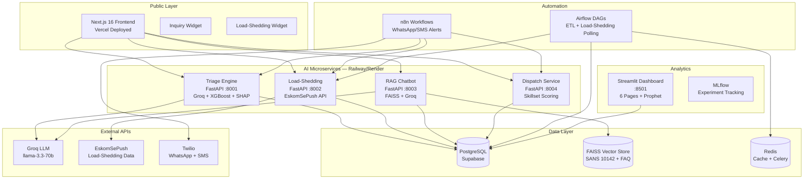

# Rams @Elec — System Architecture

## Architecture Diagram



## Data Flow: Key Journey

```
Web Form → n8n Webhook → Triage FastAPI → PostgreSQL → n8n → Twilio → Customer WhatsApp
```

## Service Descriptions

| Service | Port | Technology | Purpose |
|---------|------|-----------|---------|
| **Web Frontend** | 3000 | Next.js 16, TypeScript, Tailwind | Public site + customer portal + admin dashboard |
| **Triage Engine** | 8001 | FastAPI, Groq, XGBoost, SHAP | NLP inquiry classification, cost estimation, technician matching |
| **Load-Shedding** | 8002 | FastAPI, EskomSePush | Real-time load-shedding status, schedules, alerts |
| **RAG Chatbot** | 8003 | FastAPI, FAISS, Groq, LangChain | Knowledge-base chatbot with SANS 10142 citations |
| **Dispatch** | 8004 | FastAPI | Skillset + area + workload scoring for technician assignment |
| **Dashboard** | 8501 | Streamlit, Plotly, Prophet | 6-page analytics dashboard |
| **Airflow** | 8080 | Apache Airflow | ETL orchestration + load-shedding polling DAGs |
| **n8n** | 5678 | n8n | Automation workflows (WhatsApp/SMS notifications) |
| **PostgreSQL** | 5432 | PostgreSQL 15 | Primary database (via Supabase) |
| **Redis** | 6379 | Redis 7 | Cache + Celery broker for Airflow |

## Deployment

| Component | Platform |
|-----------|----------|
| Next.js Frontend | Vercel |
| FastAPI Services | Railway / Render |
| PostgreSQL | Supabase |
| Streamlit | Railway |
| Airflow + n8n | Self-hosted (Docker) |
