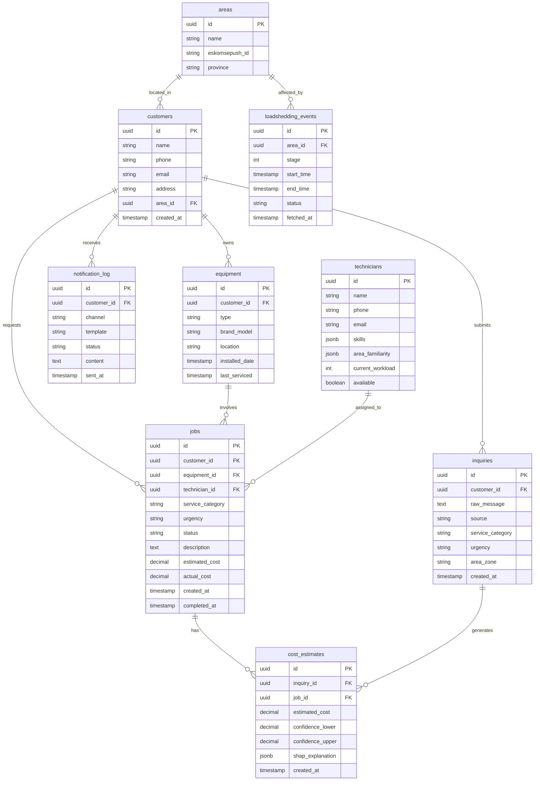

# Database Schema

## Entity Relationship Diagram

## Table Purposes

| Table | Purpose |
|-------|---------|
| **customers** | Core customer records — name, contact, location |
| **equipment** | Customer-owned equipment registry — type, model, service dates |
| **technicians** | Internal technician directory — skills, areas, availability |
| **jobs** | Work orders — links customer, equipment, and technician |
| **inquiries** | Raw inbound inquiries — pre-classification |
| **cost_estimates** | AI-generated cost predictions with SHAP explanations |
| **loadshedding_events** | Cached EskomSePush data — stage, area, timing |
| **areas** | Geographic zones mapped to EskomSePush area IDs |
| **notification_log** | Audit trail of all customer communications |

## Bronze → Silver → Gold Data Layers

### Bronze Layer (Raw Ingestion)
- Raw CSV/Excel/PDF extracts from client's existing records
- Unvalidated, messy real-world data
- Stored in `bronze_*` staging tables
- Purpose: preserve original data, never modified

### Silver Layer (Cleaned & Validated)
- Deduplicated, type-cast, validated records
- Missing values handled (imputed or flagged)
- Foreign key relationships resolved
- Stored in normalized schema tables
- Purpose: reliable, queryable operational data

### Gold Layer (Analytics-Ready)
- Aggregated, feature-engineered views
- Denormalized for dashboard performance
- Includes derived metrics (customer lifetime value, technician utilisation rate)
- Stored as materialized views / feature tables
- Purpose: feeds Streamlit dashboard and ML training
